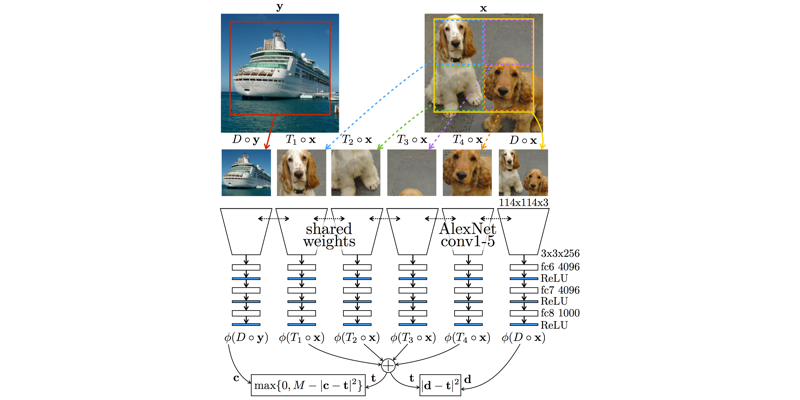
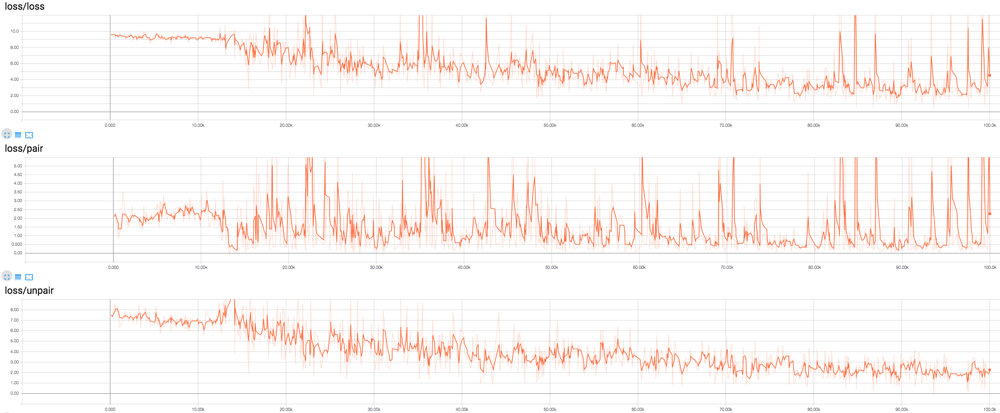

# Representation Learning by Learning to Count in Tensorflow

As part of the implementation series of [Joseph Lim's group at USC](http://csail.mit.edu/~lim), our motivation is to accelerate (or sometimes delay) research in the AI community by promoting open-source projects. To this end, we implement state-of-the-art research papers, and publicly share them with concise reports. Please visit our [group github site](https://github.com/gitlimlab) for other projects.

This project is implemented by [Shao-Hua Sun](http://shaohua0116.github.io) and the codes have been reviewed by Te-Lin Wu before being published.

## Descriptions
This project is a [Tensorflow](https://www.tensorflow.org/) implementation of [Representation Learning by Learning to Count](https://arxiv.org/abs/1708.06734). This paper proposes a novel framework for representation learning, where we are interested in learning good representations of visual content, by utilizing the concept of counting visual primitives. 

In particular, it exploits the fact that the number of visual primitives presented in an image should be invariant to transformations such as scaling, rotation, etc. Given this fact, the model is able to learn meaningful representations by minimizing a contrastive loss where we enforce that the counting feature should be different between a pair of randomly selected images. During the fine-tuning phase, we train a set of linear classifiers to perform an image classification task on ImageNet based on learned representations to verify the effectiveness of the proposed framework. An illustration of the proposed framework is as follows.



The implemented model is trained and tested on [ImageNet](http://www.image-net.org/). 

Note that this implementation only follows the main idea of the original paper while differing a lot in implementation details such as model architectures, hyperparameters, applied optimizer, etc. For example, the implementation adopts the [VGG-19](https://arxiv.org/abs/1409.1556) architecture instead of [AlexNet](https://papers.nips.cc/paper/4824-imagenet-classification-with-deep-convolutional-neural-networks.pdf) which is used in the origianl paper.

\*This code is still being developed and subject to change.

## Prerequisites

- Python 2.7
- [Tensorflow 1.2.0](https://github.com/tensorflow/tensorflow/tree/r1.2)
- [SciPy](http://www.scipy.org/install.html)
- [NumPy](http://www.numpy.org/)
- [PIL](http://pillow.readthedocs.io/en/3.1.x/installation.html)
- [h5py](http://docs.h5py.org/en/latest/)
- [colorlog](https://github.com/borntyping/python-colorlog)
- [imageio](https://imageio.github.io/)

## Usage

### Datasets
The ImageNet dataset is located in the Downloads section of the [website](http://image-net.org/download-images). Please specify the path to the downloaded dataset by changing the variable `__IMAGENET_IMG_PATH__` in `datasets/ImageNet.py`. Also, please provide a list of file names for trainings in the directory `__IMAGENET_LIST_PATH__` with the file name `train_list.txt`. By default, the `train_list.txt` includes all the training images in ImageNet dataset.

### Train the models
Train models with downloaded datasets. For example:
```bash
$ python trainer.py --prefix train_from_scratch --learning_rate 1e-4 --batch_size 8
```

### Fine-tune the models
Train models with downloaded datasets. For example:
```bash
$ python trainer_classifier.py --prefix fine_tune --learning_rate 1e-5 --batch_size 8 --checkpoint train_dir/train_from_scratch-ImageNet_lr_0.003-20170828-172936/model-10001
```
Note that you must specify a checkpoint storing the pretrained model. Also, linear classifiers are applied to all the features including `conv1`, `conv2`, ..., `fc1`, `fc2`, ..., etc, coming from the pretrained model with the same learning rate, optimizers, etc. To fine tune the model only with a certain feature, please specify it in the code `model_classifier.py`.

### Test the fine-tuned models
```bash
$ python evaler.py --checkpoint train_dir/fine_tune-ImageNet_lr_0.0001-20170915-172936/model-10001
```

### Train and test your own datasets:

* Create a directory
```bash
$ mkdir datasets/YOUR_DATASET
```
* Create a input helper `datasets/YOUR_DATASET.py` following the format of `datasets/ImageNet.py`
* Specify the path ot the image and the list of file names.
* Modify `trainer.py`.
* Finally, train and test your models
```bash
$ python trainer.py --dataset YOUR_DATASET
$ python trainer_classifier.py --dataset YOUR_DATASET --checkpoint train_dir/train_from_scratch-YOUR_DATASET_lr_0.003-20170828-172936/model-10001
$ python evaler.py --dataset YOUR_DATASET --checkpoint train_dir/fine_tune-YOUR_DATASET_lr_0.0001-20170915-172936/model-10001
```

## Training details

### Learning the representations


## Related works

* [Representation Learning: A Review and New Perspectives](https://arxiv.org/abs/1206.5538) by Bengio et. al.
* [Unsupervised Learning of Visual Representations by Solving Jigsaw Puzzles](https://arxiv.org/abs/1603.09246) by Noroozi et. al.
* [Unsupervised Representation Learning by Sorting Sequence](http://vllab1.ucmerced.edu/~hylee/OPN/) by Lee et. al.

## Author

Shao-Hua Sun / [@shaohua0116](https://github.com/shaohua0116/) @ [Joseph Lim's research lab](https://github.com/gitlimlab) @ USC
